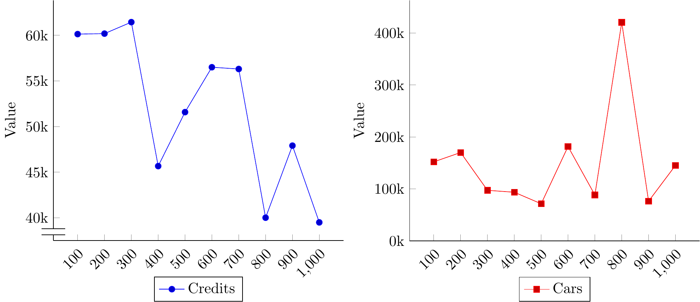

Forza Horizon 4 Wheelspins
==========================

Wheelspins is Forza Horizon's version of lootboxes.
To the best of my knowledge,
the odds are not published anywhere,
so I simply recorded a bunch of spins.

The data is in [`wheelspins.txt`](wheelspins.txt).
The file format is described in [`processing.lisp`](processing.lisp),
which also contains tools for parsing and processing the data.

Prior Work
==========

I was able to find a few Reddit posts with similar goals.

- <https://www.reddit.com/r/forza/comments/9lcjlc/> has 140 (presumably regular) early-game wheelspins.
- <https://www.reddit.com/r/forza/comments/9kp0ip/> has another 100.
- <https://www.reddit.com/r/forza/comments/azhf35/> has another 1069.
- <https://www.reddit.com/r/ForzaHorizon/comments/s2xgww> has data for Forza Horizon 5.
    This specific post asks whether skipping the animation affects the distribution
    (compared to letting the wheelspin animation play out fully).
    Answer: no.
- <https://www.reddit.com/r/ForzaHorizon/comments/r155sg> has 407 wheelspins,
    also for Forza Horizon 5.

Analysis
========

I recorded 1809 entries in `wheelspins.txt`.
I recorded each entry in the same order in which I spun the wheelspins
(i.e. opened the lootboxes)
This means that,
roughly speaking,
I spun 700 regular wheelspins,
then I supn over 250 super wheelspins
(generating 750 entries),
then finally I spun another 300 regular wheelspins.

How Cosmetics Affect the Prize Distribution
-------------------------------------------

Wheelspins sometimes gives cosmetic character customization options
(clothing and horns).
Each cosmetic can only be unlocked once,
so once a cosmetic is obtained
(whether from wheelspins or otherwise)
it is removed from the pool of possible wheelspin prizes.

As far as I'm aware,
there is only thing that influence the odds in wheelspins in Forza Horizon 4.
But how is the prize distribution shifted when cosmetics are removed from the prize pool?

I analyzed the regular wheelspins separately.
I separated them in groups of 100 wheelspins,
and counted the number of cosmetics, credit rewards, and cars in each group.

The number of cars stayed about the same,
but the number of credit rewards increased.
Therefore,
it is clear that cosmetics are simply replaced with credit rewards.

What about the rarities?
The same process gives the following graph.

There seems to be a small shift towards more common prizes,
but given the high overal variance,
this may very well be due to random chance;
i.e. I was just somewhat unlucky on the last 300 wheelspins.

For the average value of the wheelspin outcomes,
the answer is more nuanced.
The chart below splits between the value of credit rewards and the value of cars.

The credit rewards seems to be trending downwards.
This trend is actually slightly masked by two outliers in the 600 and 700 wheelspins marks
(corresponding, respectively,
to wheelspins 501 to 600,
and 601 to 700):
I got one legendary one-million-credits wheelspin in each case.
If I remove the two outliers,
the two marks sitting slightly above 55k drops to 42194 and 40836,
respectively.

For the cars,
the big spike at 800 is also due to an outlier:
the 1939 Mercedes-Benz W154,
which is worth 10 million credits.
Overall,
I rolled six cars worth over one million credits on regular wheelspins:
- regular wheelspin #9, worth 2.1 million credits, the 1965 Shelby Cobra 427 S/C;
- regular wheelspin #112, worth 3.1 million credits, the 1984 Ferrari 288 GTO;
- regular wheelspin #294, worth 1.2 million credits, the 1954 Mercedes-Benz 300 SL Coupé;
- regular wheelspin #590, worth 2.3 million credits, the 2016 Lamborghini Centenario LP 770-4;
- regular wheelspin #791, worth 10 million credits, the 1939 Mercedes-Benz W154; and
- regular wheelspin #930, worth 2.0 million credits, the 1995 Ferrari F50.

Removing the outliers gives the following (combined) graph:

The average value of the credit rewards can be clearly seen to trend downwards.
I'm not sure why this happens.
My conjecture is that,
since I mostly obtained common-rarity cosmetics from those regular wheelspins,
they are replaced mostly with common credit rewards,
who pull the average down.
That,
or cosmetics are simply replaced with low-value credit rewards.

The average value of the cars still has significant variance,
but does not seem to be trending upwards nor downwards.

### More details about the dataset

I already had unlocked a significant fraction of the wheelspin-obtainable cosmetics
before I started recording wheelspins.
I unlocked the remaining ones in the first batch of 700 regular wheelspins,
so I got no cosmetics in the following 250 super wheelspins.
So the distribution of the 250 super wheelspins and the last 300 regular wheelspins stayed constant.
This means that the order between these two batches of wheelspins does not matter,
so I can consider that those 1000 regular wheelspins happened back-to-back.

This does mean that I could not use this dataset
to estimate,
for example,
the probability of getting a cosmetic from a super wheelspin;
hence the restriction to regular wheelspins.

Comparison to Super Wheelspins
------------------------------

In the following tables,
I compare regular wheelspins to super wheelspins.

The analysis above shows that cosmetics affect the distribution of the wheelspins.
I decided to split the regular wheelspins in two groups:
the "early game regular wheelspins",
comprising the first 700 spins,
and the "late game regular wheelspins",
comprising of the remaining spins.

I got no cosmetics from the super wheelspins,
so they are analyzed as a whole.
For the analysis,
I simply counted each wheel in a super wheelspin as a separate wheelspin.
for example,
each wheelspin in a super wheelspin has about 74% chance of being a credits prize,
so each super wheelspin (all three wheels)
contains 2.22 credits prizes on average.

For my own curiosity,
I also analyzed each segment of super wheelspins separately
(i.e. all prizes obtained from the leftmost wheel in superwheelspins,
all from the center wheel,
and all from the right wheel).

The overall rarity distribution is the following.

|                                 | Common      | Rare        | Epic        | Legendary | Forza Edition |
|---------------------------------+-------------+-------------+-------------+-----------+---------------|
| Regular Wheelspins (all)        | 677 (65.3%) | 210 (20.3%) | 117 (11.3%) | 27 (2.6%) | 6 (0.6%)      |
| Regular Wheelspins (early game) | 446 (63.7%) | 150 (21.4%) | 77 (11.0%)  | 22 (3.1%) | 5 (0.7%)      |
| Regular Wheelspins (late game)  | 231 (68.5%) | 60 (17.8%)  | 40 (11.9%)  | 5 (1.5%)  | 1 (0.3%)      |
| Super Wheelspins (all wheels)   | 544 (70.6%) | 61 (7.9%)   | 94 (12.2%)  | 48 (6.2%) | 24 (3.1%)     |
| Super Wheelspin (left wheel)    | 182 (71.1%) | 17 (6.6%)   | 26 (10.2%)  | 17 (6.6%) | 14 (5.5%)     |
| Super Wheelspin (center wheel)  | 183 (70.9%) | 19 (7.4%)   | 31 (12.0%)  | 20 (7.8%) | 5 (1.9%)      |
| Super Wheelspin (right wheel)   | 179 (69.6%) | 25 (9.7%)   | 37 (14.4%)  | 11 (4.3%) | 5 (1.9%)      |

(The table contains the percentages and the actual count,
so e.g. I got 48 legendary prizes in super wheelspins,
which was 3.1% of all super wheelspin prizes.)

### More details about the dataset

I misrecorded two credits spins from super wheelspins;
I simply removed them from the database.

I did get a cosmetic from a super wheelspin after I started recording the data.
It is entry #65 in `wheelspins.txt`,
and I decided to simply ignore it,
to simplify the analysis.

The dataset also records
whether each spin was on the left, center, or right portion of a super wheelspin.
This could be used,
for example,
to analyze whether these have different distributions from the others;
or whether getting e.g. credits on the first spin influences the distribution in the other two.
This would probably require more data though,
and since I suspect the answer is "no" for both,
I didn't bother.
