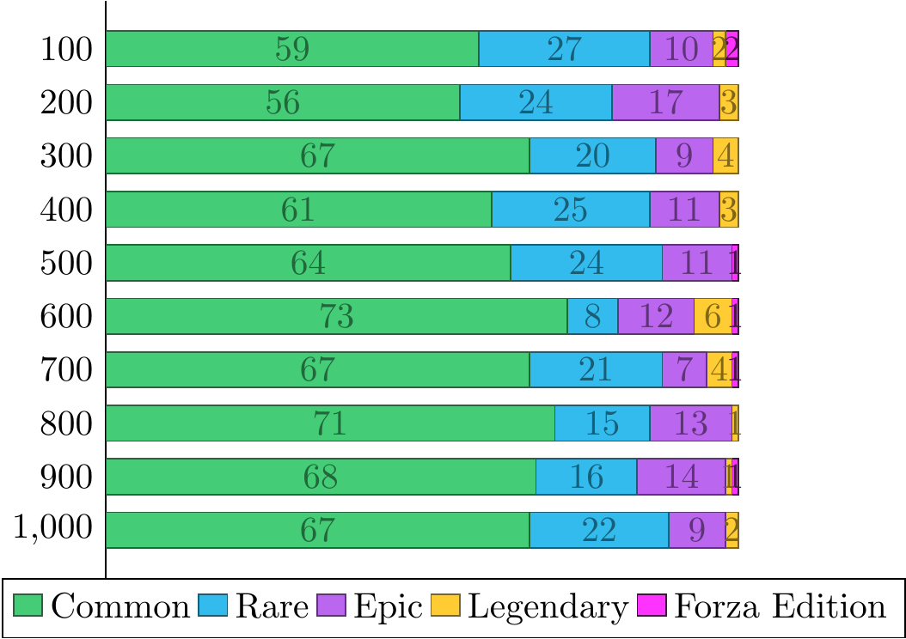
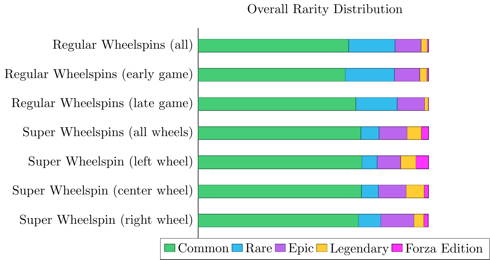

Forza Horizon 4 Wheelspins
==========================

Wheelspins is Forza Horizon's version of lootboxes.
To the best of my knowledge,
the odds are not published anywhere,
so I simply recorded a bunch of spins.

The data is in [`wheelspins.txt`](wheelspins.txt).
The file format is described in [`processing.lisp`](processing.lisp),
which also contains tools for parsing and processing the data.

Prior Work
==========

I was able to find a few Reddit posts with similar goals.

- <https://www.reddit.com/r/forza/comments/9lcjlc/> has 140 (presumably regular) early-game wheelspins.
- <https://www.reddit.com/r/forza/comments/9kp0ip/> has another 100.
- <https://www.reddit.com/r/forza/comments/azhf35/> has another 1069.
- <https://www.reddit.com/r/ForzaHorizon/comments/s2xgww> has data for Forza Horizon 5.
    This specific post asks whether skipping the animation affects the distribution
    (compared to letting the wheelspin animation play out fully).
    Answer: no.
- <https://www.reddit.com/r/ForzaHorizon/comments/r155sg> has 407 wheelspins,
    also for Forza Horizon 5.

Analysis
========

I recorded 1808 entries in `wheelspins.txt`.
I recorded each entry in the same order in which I spun the wheelspins
(i.e. opened the lootboxes)
This means that,
roughly speaking,
I spun 700 regular wheelspins,
then I supn over 250 super wheelspins
(generating 750 entries),
then finally I spun another 300 regular wheelspins.

How Cosmetics Affect the Prize Distribution
-------------------------------------------

Wheelspins sometimes gives cosmetic character customization options
(clothing and horns).
Each cosmetic can only be unlocked once,
so once a cosmetic is obtained
(whether from wheelspins or otherwise)
it is removed from the pool of possible wheelspin prizes.

As far as I'm aware,
there is only thing that influence the odds in wheelspins in Forza Horizon 4.
But how is the prize distribution shifted when cosmetics are removed from the prize pool?

I analyzed the regular wheelspins separately.
I separated them in groups of 100 wheelspins,
and counted the number of cosmetics, credit rewards, and cars in each group.

The number of cars stayed about the same,
but the number of credit rewards increased.
Therefore,
it is clear that cosmetics are simply replaced with credit rewards.

What about the rarities?
The same process gives the following graph.

There seems to be a small shift towards more common prizes,
but given the high overal variance,
this may very well be due to random chance;
i.e. I was just somewhat unlucky on the last 300 wheelspins.

For the average value of the wheelspin outcomes,
the answer is more nuanced.
The chart below splits between the value of credit rewards and the value of cars.

The credit rewards seems to be trending downwards.
This trend is actually slightly masked by two outliers in the 600 and 700 wheelspins marks
(corresponding, respectively,
to wheelspins 501 to 600,
and 601 to 700):
I got one legendary one-million-credits wheelspin in each case.
If I remove the two outliers,
the two marks sitting slightly above 55k drops to 42418 and 40836,
respectively.

For the cars,
the big spike at 800 is also due to an outlier:
the 1939 Mercedes-Benz W154,
which is worth 10 million credits.
Overall,
I rolled six cars worth over one million credits on regular wheelspins;
a list of all outliers is available in the "Outliers" section below.

Removing the outliers gives the following (combined) graph:

The average value of the credit rewards can be clearly seen to trend downwards.
I'm not sure why this happens.
My conjecture is that,
since I mostly obtained common-rarity cosmetics from those regular wheelspins,
they are replaced mostly with common credit rewards,
who pull the average down.
That,
or cosmetics are simply replaced with low-value credit rewards.

The average value of the cars still has significant variance,
but does not seem to be trending upwards nor downwards.

### More details about the dataset

I already had unlocked a significant fraction of the wheelspin-obtainable cosmetics
before I started recording wheelspins.
I unlocked the remaining ones in the first batch of 700 regular wheelspins,
so I got no cosmetics in the following 250 super wheelspins.
So the distribution of the 250 super wheelspins and the last 300 regular wheelspins stayed constant.
This means that the order between these two batches of wheelspins does not matter,
so I can consider that those 1000 regular wheelspins happened back-to-back.

This does mean that I could not use this dataset
to estimate,
for example,
the probability of getting a cosmetic from a super wheelspin;
hence the restriction to regular wheelspins.

Lastly,
I had to alter two records during the analysis.
One was a 175k credits rewards that was labeled as a "rare" prize,
which I relabeled it to an "epic" prize;
and a 230k epic credits prize.
Since that record was the only one of its kind,
it was most definitely a misrecording,
so I simply removed that record from the dataset.

Comparison to Super Wheelspins
------------------------------

In the following tables,
I compare regular wheelspins to super wheelspins.

The analysis above shows that cosmetics affect the distribution of the wheelspins.
I decided to split the regular wheelspins in two groups:
the "early game regular wheelspins",
comprising the first 700 spins,
and the "late game regular wheelspins",
comprising of the remaining spins.

I got no cosmetics from the super wheelspins,
so they are analyzed as a whole.
For the analysis,
I simply counted each prize in a super wheelspin as a separate wheelspin.
For example,
each wheelspin in a super wheelspin has about 74% chance of being a credits prize,
so each super wheelspin (all three wheels)
contains 2.22 credits prizes on average.

For my own curiosity,
I also analyzed each segment of super wheelspins separately
(i.e. all prizes obtained from the leftmost wheel in superwheelspins,
all from the center wheel,
and all from the right wheel).

The overall rarity distribution is the following.

|                                 | Common      | Rare        | Epic        | Legendary | Forza Edition |
|---------------------------------+-------------+-------------+-------------+-----------+---------------|
| Regular Wheelspins (all)        | 677 (65.3%) | 209 (20.2%) | 117 (11.3%) | 27 (2.6%) | 6 (0.6%)      |
| Regular Wheelspins (early game) | 447 (63.9%) | 149 (21.3%) | 77 (11.0%)  | 22 (3.1%) | 5 (0.7%)      |
| Regular Wheelspins (late game)  | 230 (68.5%) | 60 (17.9%)  | 40 (11.9%)  | 5 (1.5%)  | 1 (0.3%)      |
| Super Wheelspins (all wheels)   | 544 (70.6%) | 61 (7.9%)   | 94 (12.2%)  | 48 (6.2%) | 24 (3.1%)     |
| Super Wheelspin (left wheel)    | 182 (71.1%) | 17 (6.6%)   | 26 (10.2%)  | 17 (6.6%) | 14 (5.5%)     |
| Super Wheelspin (center wheel)  | 183 (70.9%) | 19 (7.4%)   | 31 (12.0%)  | 20 (7.8%) | 5 (1.9%)      |
| Super Wheelspin (right wheel)   | 179 (69.6%) | 25 (9.7%)   | 37 (14.4%)  | 11 (4.3%) | 5 (1.9%)      |

(The table contains the percentages and the actual count,
so e.g. I got 48 legendary prizes in super wheelspins,
which was 3.1% of all super wheelspin prizes.)

I will focus on comparing late-game regular wheelspins with overall superwheelspins
(rows 3 and 4 in the table above).
Recall that I opened the super wheelspins only after getting all cosmetics from regular wheelspins,
so in a sense the super wheelspins are also "late-game".

The number of common prizes is around 70% in both cases,
and also epic rewards hover at about 12%.
The proportion of rare prizes in super wheelspins is less than half compared to regular wheelspins
(in fact,
epic rewards are more common than rare rewards for super wheelspins),
and the proportion of legendary rewards is about 4 times higher on super wheelspins.
Recall that the three prizes in each super wheelspin are recorded individually,
so a singular super wheelspin,
with the three prizes,
will yield about 12 times more legendary prizes than a singular regular wheelspin.

Since I got only one Forza Edition prize on late-game regular wheelspins,
I do not have enough information to compare it to super wheelspins.

Only cars can have the "Forza Edition" rarity,
and all Forza Edition cars obtainable through wheelspins are wheelspins exclusives,
but there are some wheelspin exclusives which are not Forza Edition.
Overall,
we have the following distribution of prize types.

|                                 | Cosmetics   | Credits     | Autoshow cars | Wheelspin exclusives |
|---------------------------------+-------------+-------------+---------------+----------------------|
| Regular Wheelspins (all)        | 103 (9.9%)  | 620 (59.8%) | 298 (28.8%)   | 15 (1.4%)            |
| Regular Wheelspins (early game) | 103 (14.7%) | 380 (54.3%) | 206 (29.4%)   | 11 (1.6%)            |
| Regular Wheelspins (late game)  | 0 (0.0%)    | 240 (71.4%) | 92 (27.4%)    | 4 (1.2%)             |
| Super Wheelspins (all wheels)   | 0 (0.0%)    | 573 (74.3%) | 170 (22.0%)   | 28 (3.6%)            |
| Super Wheelspin (left wheel)    | 0 (0.0%)    | 194 (75.8%) | 47 (18.4%)    | 15 (5.9%)            |
| Super Wheelspin (center wheel)  | 0 (0.0%)    | 189 (73.3%) | 62 (24.0%)    | 7 (2.7%)             |
| Super Wheelspin (right wheel)   | 0 (0.0%)    | 190 (73.9%) | 61 (23.7%)    | 6 (2.3%)             |

The probability of getting cars seems to be slightly smaller for super wheelspins,
but the proportion of _wheelspin-exclusive_ cars is about 2.5-3 times higher.

Interestingly,
the left wheel seems to be twice as likely to yield wheelspin-exclusive cars as the other two.
This indicates that the distribution is uneven among the wheels,
but I would like to have more data before stating this with more certainty.

The table below contains the average value of the prizes.

|                                 | Credits | Cars    | Combined | Credits (no outliers) | Cars (no outliers) | Combined (no outliers) |
|---------------------------------+---------+---------+----------+-----------------------+--------------------+------------------------|
| Regular Wheelspins (all)        | 52,513  | 144,629 | 59,156   | 47,906                | 80,029             | 45,284                 |
| Regular Wheelspins (early game) | 55,813  | 122,313 | 57,755   | 50,817                | 83,765             | 47,597                 |
| Regular Wheelspins (late game)  | 47,288  | 195,073 | 61,644   | 43,301                | 71,564             | 41,179                 |
| Super Wheelspins (all wheels)   | 47,679  | 231,318 | 65,137   | 47,679                | 184,461            | 58,904                 |
| Super Wheelspin (left wheel)    | 41,830  | 264,113 | 63,682   | 41,830                | 222,541            | 58,441                 |
| Super Wheelspin (center wheel)  | 50,053  | 256,362 | 70,948   | 50,053                | 158,292            | 57,498                 |
| Super Wheelspin (right wheel)   | 51,289  | 175,179 | 60,753   | 51,289                | 175,179            | 60,753                 |

The data clearly shows that cars have about 4-5 times higher value than credit prizes.
However this figure includes outliers.
I don't know how to properly handle outliers,
so I simply decided to call a prize an "outlier" if its value was one million credits or more,
and removed them from the dataset before calculating the second set of columns in the table above.

The "combined" column tries to aggregate credits and cars.
Forza Horizon 4 allows us to sell duplicated cars for half of their value.
You might choose not to sell the car and list it on the Auction House for higher earnings,
but to simplify matters,
I assumed each car is simply sold for half of its value.
Outliers were handled as before.
Hence,
for example,
each wheel of a super wheelspin was worth 65,137 credits for me,
but removing the outliers the combined average was 58,904.
This means that a singular super wheelspin is worth about 177k credits
(counting the three wheels together).

### More details about the dataset

I misrecorded two credits spins from super wheelspins;
I simply removed them from the database.

I did get a cosmetic from a super wheelspin after I started recording the data.
It is entry #65 in `wheelspins.txt`,
and I decided to simply ignore it,
to simplify the analysis.

The dataset also records
whether each spin was on the left, center, or right portion of a super wheelspin.
This could be used,
for example,
to analyze whether these have different distributions from the others;
or whether getting e.g. credits on the first spin influences the distribution in the other two.
This would probably require more data though,
and since I suspect the answer is "no" for both,
I didn't bother.

Frequency Distribution of Credit Prizes
=======================================

A few interesting patterns arise when we isolate the credit prizes
and tally the frequency of each prize value.

Of course there is a clear bias towards common-rarity credit rewards,
but interestingly the bulk of rewards seems to be of 2k, 5k, 10k and 15k rewards.
7k rewards are about as rare as 100k rewards,
and 1k and 4k rewards are surprisingly rare;
I had the same number of 1k rewards as 250k rewards.

The plateau after 100k is also interesting:
the prizes between 110k and 200k are evenly distributed.

The plot above summarizes all regular wheelspins.
We can directly compare early-game wheelspins to late-game wheelspins:

The removal of cosmetics from the prize pool increases the probability of getting a credits reward,
but since the charts look fairly similar,
this absence does not significantly affect the distribution of the credits rewards.

And,
despite the average value of credits rewards from regular wheelspins
(48,201 without the outliers)
being similar to the corresponding value from super wheelspins
(47,679),
the distribution is quite different.

The range of possible values is significantly smaller.
Most prominently,
there are no "rare"-rarity prizes;
in fact,
there are no credit rewards with values strictly between 30k and 150k.

In the upper end,
we also see prizes worth 300k, 400k and 500k credits,
which don't show up in regular wheelspins;
but the 1M credit prize (which do show up in regular wheelspins) is absent.

In the lower end,
the prizes valued 1k, 2k, 4k and 7k are also absent.
Hence,
the absolutely worst possible super wheelspin comprises of three 5k credits rewards.
(I got this outcome twice:
once before I started recording this data,
and once afterwards.)

How much is a cosmetic worth?
=============================

I worked out one last bit of trivia from the dataset.
We know from the section above that cosmetics are replaced with credits;
presumably,
they are replaced with credit prizes of the same rarity.
What is the average value of credit prizes within each rarity?

|                                 | Common | Rare    | Epic    | Legendary |
|---------------------------------+--------+---------+---------+-----------|
| Regular Wheelspins (all)        | 13,211 | 110,056 | 175,282 | 531,250   |
| Regular Wheelspins (early game) | 13,993 | 110,000 | 175,795 | 500,000   |
| Regular Wheelspins (late game)  | 12,055 | 110,172 | 174,444 | 625,000   |

(I did not consider super wheelspins because they have no rare credit prizes.)

The value of rare and epic prizes stays remarkably constant regarding early-game vs late-game spins.
And there are too few legendary prizes to give an accurate average.
The discrepancy in the value between early game and late game common credit prizes
suggest that cosmetics are replaced with lower-value credit prizes.

We may estimate this value as follows.
14.7% of the early-game wheelspins yielded cosmetics,
and 54.3% of them yielded credits,
so cosmetics comprised 21.3% of the combined cosmetics + credits prize pool.
Once the cosmetics were removed,
the average value of the credits (including the replacements) become 12,055 credits,
whereas the average prior to the removal was 13,993.
That is,
12,055 is the weighted average of "normal" credit prizes
(13,993 credits, with weight 78.7%)
and the replacement credit prizes (with weight 21.3%);
therefore,
the replacement credit prizes must average 4,905 credits.

This is somewhat corroborated by the more prominent presence of 7k-valued credit prizes
in the frequency plot for late-game credit rewards
(compared to early-game credit rewards),
but I am not confident that I have enough data to make a definite statement.

Hence,
we may estimate the monetary value of a common cosmetic to be around 5-7k credits,
a rare cosmetic to be 110k credits,
an epic cosmetic to be 175k credits,
and a legendary cosmetic to be 500-600k credits.

I must highlight that I made several assumptions on these estimates,
so they should be taken with a grain of salt.

Outliers
========

Throughout this text,
I defined "outlier" as a result worth 1 million credits or more.
Here is a complete list of all 14 outliers I got:
- regular wheelspin #9, worth 2.1 million credits, the 1965 Shelby Cobra 427 S/C;
- regular wheelspin #111, worth 3.1 million credits, the 1984 Ferrari 288 GTO;
- regular wheelspin #293, worth 1.2 million credits, the 1954 Mercedes-Benz 300 SL Coupé;
- regular wheelspin #524, 1 million credits prize;
- regular wheelspin #589, worth 2.3 million credits, the 2016 Lamborghini Centenario LP 770-4;
- regular wheelspin #668, 1 million credits prize;
- regular wheelspin #790, worth 10 million credits, the 1939 Mercedes-Benz W154;
- regular wheelspin #929, worth 2.0 million credits, the 1995 Ferrari F50;
- regular wheelspin #1002, 1 million credits prize;
- super wheelspin #7 (left wheel), worth 2.8 million credits, the 2002 Ferrari Enzo Ferrari;
- super wheelspin #107 (center wheel), worth 1.5 million credits, the 2016 Aston Martin Vulcan;
- super wheelspin #144 (center wheel), worth 1.5 million credits, the 2013 Ferrari LaFerrari
- super wheelspin #170 (center wheel), worth 1.0 million credits, the 2004 Maserati MC12; and
- super wheelspin #257 (center wheel), worth 3.4 million credits, the 2016 W Motors Lykan HyperSport.
